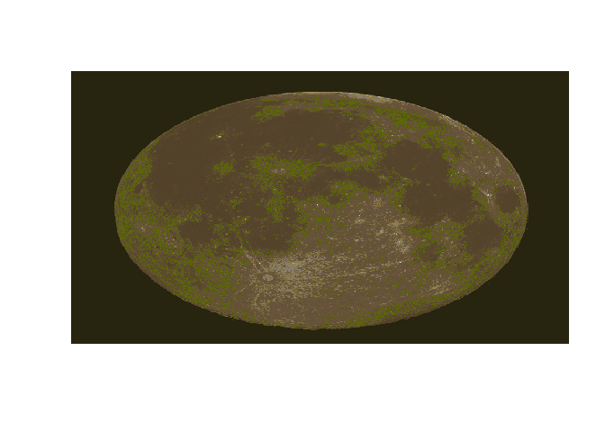

RImagePalette: Extract colors from an image, and use it in plots or for fun!
============================================================================

The `RImagePalette` package lets you use the colors from an image you like to create pretty plots.

This package is available from [CRAN](https://cran.r-project.org/web/packages/RImagePalette/index.html) using:

``` r
install.packages("RImagePalette")
library(RImagePalette)
```

Just for fun
============

``` r
america <- jpeg::readJPEG("figs/AmericanFlag.jpg")
obama <- jpeg::readJPEG("figs/Obama.jpg")
switch_colors(obama, sample(create_palette(america, choice=median, 4)))
```


``` r
gephy <- jpeg::readJPEG("figs/Gephyrocapsa.jpg")
moon <- jpeg::readJPEG("figs/Moon.jpg")
switch_colors(moon, sort(create_palette(gephy, choice=mean, 15, volume=TRUE)))
```

 \#Inspiration:

<https://github.com/lokesh/color-thief/blob/master/src/color-thief.js>

<https://github.com/karthik/wesanderson>

<http://www.r-bloggers.com/towards-yet-another-r-colour-palette-generator-step-one-quentin-tarantino/>
