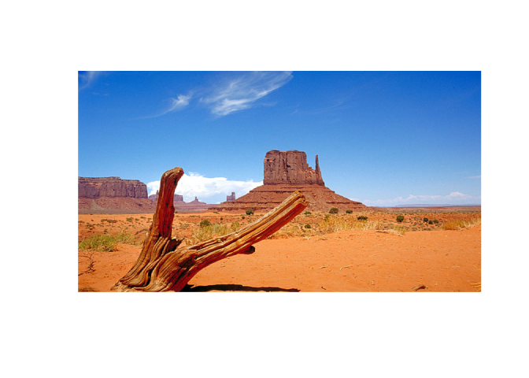
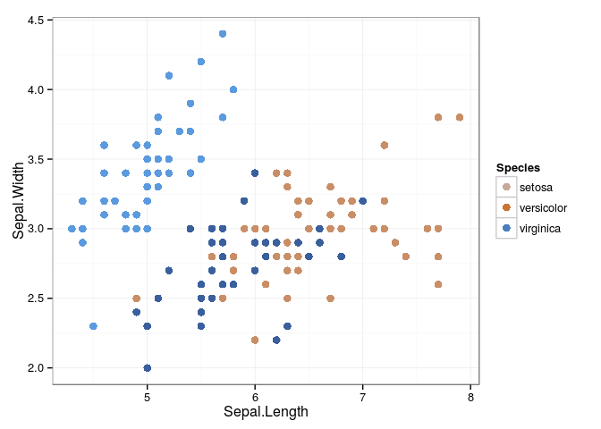
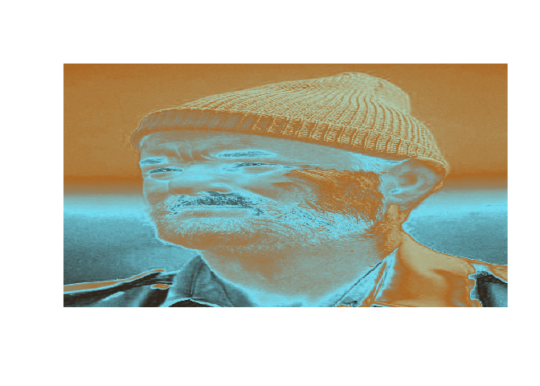

Ever wonder what Bill Murray might look like if he were the same colors as a bowl of celery?

Perhaps you've been curious about how your favorite plot might look if it was, say, the colors of your favorite desert vista...

What if I told you these daily quandaries had been solved?

**Search no more, for here lay your answers! Read on to discover the answers to these questions, and more!**

RImagePalette: Extract colors from an image, and use it in plots or for fun!
============================================================================

The `RImagePalette` package lets you use the colors from an image you like to create pretty plots, or to swap colors from one image to another.

This package is available from [CRAN](https://cran.r-project.org/web/packages/RImagePalette/index.html) using:

``` r
install.packages("RImagePalette")
library(RImagePalette)
```

Images as Scales
================

Here's a common situation - you have made a plot using your favorite plotting package, `ggplot2`, but just can't find the right colors to represent the points. Simulataneously, you are thinking about this wonderful photo of the desert you took last week. What can you do?

Why not combine the two? The `RImagePalette` package let's you do just that:

First, load your image:

``` r
desert <- jpeg::readJPEG("figs/Desert.jpg")
display_image(desert)
```



Then plot it using the new `scale_color_image`:

``` r
#Create your plot, and use scale_color_image:
library(ggplot2)
p <- ggplot(data = iris, aes(x=Sepal.Length, y=Sepal.Width, col=Species)) + geom_point(size=3)
p + theme_bw() + scale_color_image(image=desert)
```



Just for fun
============

You didn't think I forgot about old Bill and celery plate complexion, did you?

``` r
celery <- jpeg::readJPEG("figs/Lunch.jpg")
billMurray <- jpeg::readJPEG("figs/LifeAquatic.jpg")
set.seed(10)
switch_colors(billMurray, celery, source_colors = 5, choice=median)
```



``` r
america <- jpeg::readJPEG("figs/AmericanFlag.jpg")
obama <- jpeg::readJPEG("figs/Obama.jpg")
switch_colors(obama, america, source_colors=5, smoothness=500)
```


Inspiration:
============

<https://github.com/lokesh/color-thief/blob/master/src/color-thief.js>

<https://github.com/karthik/wesanderson>

<http://www.r-bloggers.com/towards-yet-another-r-colour-palette-generator-step-one-quentin-tarantino/>
